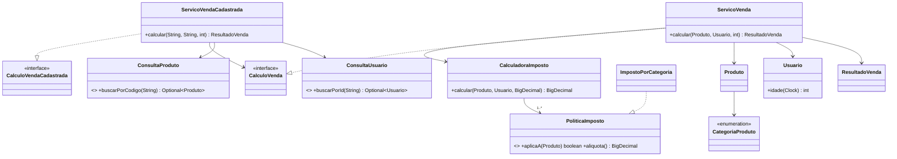

# Sistema de Vendas da Sbørnia — camada de negócios

Projeto didático em Java 21 e Spring Boot. O escopo implementado é exclusivamente a camada
de negócios: não há banco de dados, repositórios concretos, controllers REST nem interface
de usuário. `spring-boot-starter-web` e DevTools estão configurados conforme solicitado.

## Passo a passo da solução

1. **Modelo:** `Produto`, `Usuario`, `CategoriaProduto` e `ResultadoVenda` representam os
   dados usados pelas regras, sem dependência do Spring.
2. **Interfaces entre camadas:** `CalculoVenda` e `CalculoVendaCadastrada` são portas de
   entrada para futuras interfaces; `ConsultaProduto` e `ConsultaUsuario` são portas de
   saída que deverão ser implementadas pelos sistemas externos, fora deste exercício.
3. **Subtotal:** `ServicoVenda` valida a quantidade/estoque e calcula
   `preço unitário × quantidade`.
4. **Imposto por categoria:** cada `PoliticaImposto` informa se atende ao produto e fornece
   sua alíquota: alimento 5%, automotivo 30%, bebida alcoólica 100% e outros 17%.
5. **Benefícios do usuário:** depois do imposto base, maiores de 60 anos ficam isentos;
   usuários com mais de 3 dependentes pagam metade do imposto. Bebidas alcoólicas não
   recebem nenhum desses benefícios.
6. **Resultado:** subtotal, imposto e valor final são arredondados para duas casas decimais.
7. **Configuração:** `ConfiguracaoNegocio` monta as estratégias e o serviço como beans.

## Padrões utilizados

- **Arquitetura em camadas:** domínio e serviços ficam no pacote `negocio`; configuração do
  framework fica separada em `configuracao`. Persistência e apresentação poderão ser
  acrescentadas sem alterar as regras.
- **Strategy:** `PoliticaImposto` permite adicionar uma nova política sem modificar o serviço
  de venda. A lista injetada funciona como um catálogo de estratégias.
- **Dependency Injection:** a configuração Spring injeta estratégias e relógio. O `Clock`
  injetável torna a regra de idade determinística nos testes.
- **Service Layer:** `ServicoVenda` é o ponto de entrada para o caso de uso de cálculo.
- **Ports and Adapters:** as interfaces em `porta.entrada` e `porta.saida` isolam o negócio
  das futuras implementações de terminal, REST, banco de dados e sistemas externos.

## Diagrama de classes



## Executar

```bash
./mvnw test
./mvnw spring-boot:run
```

Não existe endpoint web neste escopo; ao iniciar, a aplicação apenas carrega os beans da
camada de negócios.
