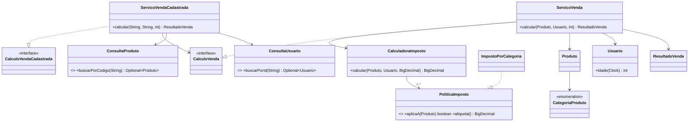

# Sistema de Vendas da Sbørnia — camada de negócios

Projeto didático em Java 21 e Spring Boot. O escopo implementado é exclusivamente a camada
de negócios: não há banco de dados, repositórios concretos, controllers REST nem interface
de usuário. `spring-boot-starter-web` e DevTools estão configurados conforme solicitado.

## Passo a passo da solução

1. **Modelo:** `Produto`, `Usuario`, `CategoriaProduto` e `ResultadoVenda` representam os
   dados usados pelas regras, sem dependência do Spring.
2. **Interfaces entre camadas:** `CalculoVenda` e `CalculoVendaCadastrada` são portas de
   entrada para futuras interfaces; `ConsultaProduto` e `ConsultaUsuario` são portas de
   saída que deverão ser implementadas pelos sistemas externos, fora deste exercício.
3. **Subtotal:** `ServicoVenda` valida a quantidade/estoque e calcula
   `preço unitário × quantidade`.
4. **Imposto por categoria:** cada `PoliticaImposto` informa se atende ao produto e fornece
   sua alíquota: alimento 5%, automotivo 30%, bebida alcoólica 100% e outros 17%.
5. **Benefícios do usuário:** depois do imposto base, maiores de 60 anos ficam isentos;
   usuários com mais de 3 dependentes pagam metade do imposto. Bebidas alcoólicas não
   recebem nenhum desses benefícios.
6. **Resultado:** subtotal, imposto e valor final são arredondados para duas casas decimais.
7. **Configuração:** `ConfiguracaoNegocio` monta as estratégias e o serviço como beans.

## Padrões utilizados

- **Arquitetura em camadas:** domínio e serviços ficam no pacote `negocio`; configuração do
  framework fica separada em `configuracao`. Persistência e apresentação poderão ser
  acrescentadas sem alterar as regras.
- **Strategy:** `PoliticaImposto` permite adicionar uma nova política sem modificar o serviço
  de venda. A lista injetada funciona como um catálogo de estratégias.
- **Dependency Injection:** a configuração Spring injeta estratégias e relógio. O `Clock`
  injetável torna a regra de idade determinística nos testes.
- **Service Layer:** `ServicoVenda` é o ponto de entrada para o caso de uso de cálculo.
- **Ports and Adapters:** as interfaces em `porta.entrada` e `porta.saida` isolam o negócio
  das futuras implementações de terminal, REST, banco de dados e sistemas externos.

## Diagrama de classes


```mermaid
classDiagram
  class ServicoVenda { +calcular(Produto, Usuario, int) ResultadoVenda }
  class ServicoVendaCadastrada { +calcular(String, String, int) ResultadoVenda }
  class CalculoVenda { <<interface>> }
  class CalculoVendaCadastrada { <<interface>> }
  class ConsultaProduto { <<interface>> +buscarPorCodigo(String) Optional~Produto~ }
  class ConsultaUsuario { <<interface>> +buscarPorId(String) Optional~Usuario~ }
  class CalculadoraImposto { +calcular(Produto, Usuario, BigDecimal) BigDecimal }
  class PoliticaImposto { <<interface>> +aplicaA(Produto) boolean +aliquota() BigDecimal }
  class ImpostoPorCategoria
  class Produto
  class Usuario { +idade(Clock) int }
  class CategoriaProduto { <<enumeration>> }
  class ResultadoVenda

  ServicoVenda --> CalculadoraImposto
  ServicoVenda ..|> CalculoVenda
  ServicoVendaCadastrada ..|> CalculoVendaCadastrada
  ServicoVendaCadastrada --> CalculoVenda
  ServicoVendaCadastrada --> ConsultaProduto
  ServicoVendaCadastrada --> ConsultaUsuario
  ServicoVenda --> Produto
  ServicoVenda --> Usuario
  ServicoVenda --> ResultadoVenda
  CalculadoraImposto --> "1..*" PoliticaImposto
  ImpostoPorCategoria ..|> PoliticaImposto
  Produto --> CategoriaProduto
```

## Persistência e API REST

A segunda etapa do exercício acrescenta a camada de persistência (Spring Data JPA) e a
camada web (Spring MVC), sem alterar as regras já implementadas na camada de negócios:

- **Entidades JPA:** `Produto` e `Usuario` (pacote `negocio.modelo`) passaram de `record`
para classes anotadas com `@Entity`, pois o JPA precisa de um construtor vazio e de
instâncias mutáveis para gerenciar o ciclo de vida dos objetos persistidos. As mesmas
classes recebem também as anotações do Bean/Spring Validation (`@NotBlank`, `@Min`,
`@DecimalMin`, `@Past`, etc.), reaproveitadas tanto para validar antes de persistir quanto
para validar o corpo das requisições REST.
- **Repositórios:** `ProdutoRepository` e `UsuarioRepository` (pacote `persistencia`)
estendem `JpaRepository`, dispensando implementação manual de CRUD.
- **Adapters:** `ConsultaProdutoJpaAdapter` e `ConsultaUsuarioJpaAdapter` (pacote
`persistencia`) implementam as portas de saída `ConsultaProduto`/`ConsultaUsuario` que já
existiam na camada de negócios, delegando aos repositórios. Isso mantém a arquitetura de
Ports and Adapters: o domínio continua sem depender do Spring Data.
- **Banco de dados:** H2 em memória (`spring.datasource.url=jdbc:h2:mem:sbornia`), configurado
em `src/main/resources/application.properties`. As tabelas são geradas automaticamente a
partir das entidades (`spring.jpa.hibernate.ddl-auto=update`).
- **Camada REST (pacote `web`):**
  - `POST /api/produtos`, `GET /api/produtos`, `GET /api/produtos/{codigo}`,
  `DELETE /api/produtos/{codigo}`
  - `POST /api/usuarios`, `GET /api/usuarios`, `GET /api/usuarios/{id}`,
  `DELETE /api/usuarios/{id}`
  - `POST /api/vendas` — recebe `{ "codigoProduto", "idUsuario", "quantidade" }`
  (validado via `@Valid`) e delega para `CalculoVendaCadastrada`, retornando o
  `ResultadoVenda` calculado pela camada de negócios já existente.
  - `TratadorDeErros` (`@RestControllerAdvice`) converte erros de validação (400 com a
  lista de campos inválidos), regras de negócio violadas (400) e registros não
  encontrados (404) em respostas JSON padronizadas.

### Exemplo de uso

```bash
curl -X POST http://localhost:8080/api/produtos -H "Content-Type: application/json" -d \
  '{"codigo":"P1","descricao":"Arroz","quantidadeEmEstoque":100,"precoUnitario":10.00,"categoria":"ALIMENTICIO"}'

curl -X POST http://localhost:8080/api/usuarios -H "Content-Type: application/json" -d \
  '{"id":"U1","nome":"Maria","dataNascimento":"1990-01-01","numeroDependentes":0}'

curl -X POST http://localhost:8080/api/vendas -H "Content-Type: application/json" -d \
  '{"codigoProduto":"P1","idUsuario":"U1","quantidade":2}'
```

## Executar

```bash
./mvnw test
./mvnw spring-boot:run
```

O console do H2 fica disponível em `http://localhost:8080/h2-console`
(JDBC URL: `jdbc:h2:mem:sbornia`, usuário `sa`, senha em branco).
